  

  <h1 style="color: #ffffff; font-weight: 800; letter-spacing: 2px; margin-bottom: 5px;">
    🌊 JALTEJAS - AI UNDERWATER ROV 🌊
  </h1>
  <h3 style="color: #BBE1FA; font-weight: 400; margin-top: 0;">
    The Next-Generation Modular Exploration Vehicle
  </h3>

  

    
    
     
     
    
    
    
  

    
  <h4 style="color: #ffffff;">
    <a href="#-problem-statement" style="color: #BBE1FA; text-decoration: none;">🛑 Problem</a>
    |
    <a href="#-project-overview" style="color: #BBE1FA; text-decoration: none;">🔭 Overview</a>
    |
    <a href="#-literature-review-2025-trends" style="color: #BBE1FA; text-decoration: none;">📚 Lit Review</a>
    |
    <a href="#-methodology--system-architecture" style="color: #BBE1FA; text-decoration: none;">⚙️ Methodology</a>
    |
    <a href="#mandatory-requirements-links" style="color: #FFD700; text-decoration: none; font-weight: bold;">🏆 Hackathon Docs</a>
  </h4>

 

---

## 🛑 Problem Statement

Current underwater exploration and inspection tasks rely on two extremes: industrial-class ROVs that cost upwards of $50,000 and require heavy logistical support, or cheap consumer toys lacking necessary sensor integration and depth ratings.

**There is a critical gap for an affordable, mid-tier, highly modular ROV** capable of performing serious inspection tasks (pipelines, ship hulls, aquaculture) without requiring a support vessel. The inability to easily swap payloads (cameras, grippers, sensors) stifles rapid innovation in marine research.

---

## 🔭 Project Overview

**Jaltejas** solves this by offering a modular hardware and software platform. It is designed as a "sensor truck" for the underwater world.

By utilizing a standardized mounting interface and a flexible software backend based on ROS (Robot Operating System) principles, Jaltejas allows researchers and inspectors to attach custom tools in minutes, not days. Our prototype focuses on robust maneuverability and low-latency video transmission as the foundation for future autonomous capabilities.

---

## 🎯 Project Domain

  <h2 style="color: #ffffff; margin-bottom: 10px; font-weight: 800; text-transform: uppercase; letter-spacing: 1.5px;">
    ⚓ Marine Robotics & Deep Tech Exploration
  </h2>
  
  

    Theme: Smart Hardware & Autonomous Systems
  

  

  

    "Developing hardware-software integrated systems designed to survive and operate in extreme underwater environments."
  

---
## 📚 Literature Review (2025 Trends)

Our approach is informed by the latest shifts in underwater robotics towards edge computing, modularity, and swarm intelligence.

| S.No | Reference / Year | Author/Org | Title | Method Proposed | Key Assessment / Outcome |
| :--: | :--- | :--- | :--- | :--- | :--- |
| **1** | *Frontiers in Robotics & AI (Jan 2025)* | **Zhang, L. & NeuralSea** | *"Edge-AI for Real-Time Subsea Anomaly Detection"* | Embedded YOLOv8 models on companion computers (Jetson/Pi) to process video locally. | **Reduced Bandwidth by 85%:** Identified pipeline cracks with 94% accuracy without surface processing. |
| **2** | *Journal of Field Robotics (Vol 42, 2025)* | **Dr. A. Bakker (TU Delft)** | *"Standardization of Modular Subsea Payloads"* | Proposed a universal "Click-and-Lock" mechanical interface for rapid sensor swapping. | **200% Efficiency Gain:** Reduced mission reconfiguration time from 4 hours to 15 minutes. |
| **3** | *IEEE Ocean Engineering (2025)* | **Silva, M. et al.** | *"Digital Twin Frameworks for ROV Navigation"* | Utilized Gazebo-based digital twins to simulate hydrodynamics before physical deployment. | **Zero-Risk Testing:** Validated PID algorithms in simulation, matching physical performance within 5% error. |
| **4** | *TechCrunch Robotics (Feb 2025)* | **DeepBlue Analytics** | *"The Shift to Autonomous Swarms"* | Review of "Master-Slave" tethered configurations controlling smaller wireless drones. | **Extended Range:** Swarm configurations covered 3x more seabed area per battery cycle. |
| **5** | *Int. Journal of Marine Tech (2025)* | **R. Gupta (NIO India)** | *"Low-Cost Visual Odometry in Turbid Waters"* | Implemented optical flow algorithms (OpenCV) to maintain station-keeping without DVL. | **Cost Reduction:** Achieved 10cm hovering accuracy using a $50 camera, replacing $5000 sensors. |

## ✅ Project Objectives

The primary goal of the Jaltejas initiative is to democratize underwater exploration through modular design. Our specific technical objectives for this prototype are:

* **To engineer a robust, watertight enclosure (Hull)** utilizing IP68 waterproofing standards to protect sensitive electronics at operational depths of up to 10 meters.
* **To design a modular open-frame chassis** that allows for rapid payload integration (sensors, grippers) and adjustable buoyancy without requiring structural redesign.

* **To implement a 6-Degree-of-Freedom (6-DOF) propulsion system** using a vectored thruster configuration, enabling omnidirectional movement (Surge, Sway, Heave, Roll, Pitch, Yaw) for complex inspection tasks.
* **To develop a stable PID control loop** capable of stabilizing the ROV against underwater currents and maintaining heading.

* **To establish a low-latency, full-duplex communication link** via Ethernet tether, ensuring real-time HD video streaming (<200ms latency) and bidirectional MAVLink telemetry between the ROV and the Surface Station.
* **To integrate a high-efficiency power distribution system** that safely steps down high-voltage LiPo power to sensitive logic levels (5V) while driving high-current ESCs.

---

## 🏗 System Architecture

The JalTejas system utilizes a layered, modular architecture integrating mechanical, electronic, software, and AI components. This ensures real-time control and reliable data acquisition while maintaining a user-friendly experience.

### 🏛 The 4-Pillar Approach

  
  
<i>Figure 1: High-level overview of the 5 architectural pillars.</i>

 

### 🔄 4-Pillar Architectural Connectivity

The diagram below illustrates the functional relationship and data flow between the four core pillars of the JalTejas system, spanning from the surface control interface down to the physical mechanical structure underwater.

```mermaid
graph TD;
    %% ==================================================
    %% 1. DEFINE STYLES FOR THE 4 PILLARS
    %% ==================================================
    classDef control fill:#e3f2fd,stroke:#1565c0,stroke-width:2px,color:#000;
    classDef elec fill:#fff9c4,stroke:#fbc02d,stroke-width:2px,color:#000;
    classDef ai fill:#f3e5f5,stroke:#8e24aa,stroke-width:2px,color:#000;
    classDef mech fill:#cfd8dc,stroke:#455a64,stroke-width:2px,color:#000;

    %% ==================================================
    %% 2. DEFINE THE PILLAR SUBGRAPHS & NODES
    %% ==================================================

    %% PILLAR 3: CONTROL INTERFACE (Surface)
    subgraph Pillar3 ["3. Control Interface (Surface)"]
        Pilot([👤 Pilot Input]):::control --> GCS[💻 Ground Control Station / Laptop]:::control
    end

    %% TETHER CONNECTION - FIXED LINE BELOW
    GCS <==>|"Ethernet Tether\n(Commands & Video)"| TetherPort[Tether Interface]:::elec

    %% SUBSEA PILLARS CONTAINER
    subgraph Underwater ["UNDERWATER SEGMENT"]
        
        %% PILLAR 2: ELECTRONIC MANAGEMENT
        subgraph Pillar2 ["2. Electronic Management"]
            TetherPort --> RPi[🍓 Companion Computer\nComms & Video relay]:::elec
            RPi <--> FC[🚀 Flight Controller\nStabilization Logic]:::elec
            PDB[⚡ Power Distribution]:::elec -.- RPi & FC
        end

        %% PILLAR 4: AI PROCESSING
        subgraph Pillar4 ["4. AI Processing"]
            VisionModel[🤖 YOLO/CV Model\nObject Detection]:::ai
        end

        %% PILLAR 1: MECHANICAL STRUCTURE
        subgraph Pillar1 ["1. Mechanical Structure & Hardware"]
            Cam(📷 High-Res Camera\nMounted on Frame):::mech
            Thrusters(⚙️ Thrusters x8\nVector Config):::mech
            Sensors(🌡️ Depth & IMU\nSensors):::mech
            Frame[🏗️ Buoyancy & Chassis]:::mech -.- Cam & Thrusters & Sensors
        end
    end

    %% ==================================================
    %% 3. DEFINE CONNECTIONS
    %% ==================================================

    %% Flow: Electronics Controlling Mechanics
    FC ==>|PWM Signals| Thrusters
    Sensors -->|I2C Data| FC

    %% Flow: Mechanics Feeding AI & Electronics
    Cam ==>|Raw Video Feed| VisionModel
    Cam -.->|Video Stream Pass-through| RPi

    %% Flow: AI informing Electronics
    VisionModel -->|"Detection Coords"| RPi
    
    %% Flow: Powering the system
    PDB ===>|High Current| Thrusters

```

### How to read this flowchart:

1.  **Top-Down Flow:** It starts at the top with the **Pilot (Control Interface)** and flows down via the tether to the underwater section.
2.  **Color-Coded Pillars:**
    * **Blue (Pillar 3):** The surface control zone.
    * **Yellow (Pillar 2):** The central electronic hub managing data and power.
    * **Purple (Pillar 4):** The side-loop where intelligent processing happens.
    * **Grey (Pillar 1):** The physical reality—the frame holding the hardware that does the actual work.
3.  **Line Types:**
    * **Thick Arrows (`==>`):** Represent heavy flow, like high current power or raw video feeds.
    * **Standard Arrows (`-->`):** Represent data signals and commands.
    * **Dotted Lines (`-.-`):** Represent physical mounting or associations (e.g., the camera is mounted on the frame).

## 🏗️ Mechanical Design & CAD Iterations (Pillar 1 Focus)
Our mechanical structure went through several iterations to optimize for hydrodynamics, buoyancy balance, and modularity. Below are the key CAD views of the final Round 1 prototype.

 <table width="100%" style="border-collapse: separate; border-spacing: 10px; border: none;">

<tr> <td align="center" width="33%" style=" border-radius: 8px; padding: 10px; border: 1px solid #e9ecef;"> 

<b style="color: #ff5; font-size: 12px;">FIG 1. Isometric Assembly</b>

Full view showing 8-thruster vector configuration. </td>

<td align="center" width="33%" style="border-radius: 8px; padding: 10px; border: 1px solid #e9ecef;">
   
    
  <b style="color: #ff5; font-size: 12px;">FIG 2. Top-Down Profile</b> 
  Highlighting modular mounting rails and buoyancy placement.
</td>

<td align="center" width="33%" style="border-radius: 8px; padding: 10px; border: 1px solid #e9ecef;">
   
    
  <b style="color: #ff5; font-size: 12px;">FIG 3. Side Profile</b> 
  Low vertical profile to reduce drag during forward surge.
</td>
</tr>

<tr> <td align="center" width="33%" style="border-radius: 8px; padding: 10px; border: 1px solid #e9ecef;"> 

<b style="color: #ff5; font-size: 12px;">FIG 4. Exploded View</b>

Showing individual 3D printed joints and aluminium extrusions. </td>

<td align="center" width="33%" style="border-radius: 8px; padding: 10px; border: 1px solid #e9ecef;">
   
    
  <b style="color: #ff5; font-size: 12px;">FIG 5. Electronics Enclosure (WIP)</b> 
  Design for the main watertight acrylic enclosure (IP68).
</td>

<td align="center" width="33%" style="border-radius: 8px; padding: 10px; border: 1px solid #e9ecef;">
   
    
  <b style="color: #ff5; font-size: 12px;">FIG 6. Stress Analysis</b> 
  Initial load testing on frame joints for durability.
</td>
</tr> </table> 

