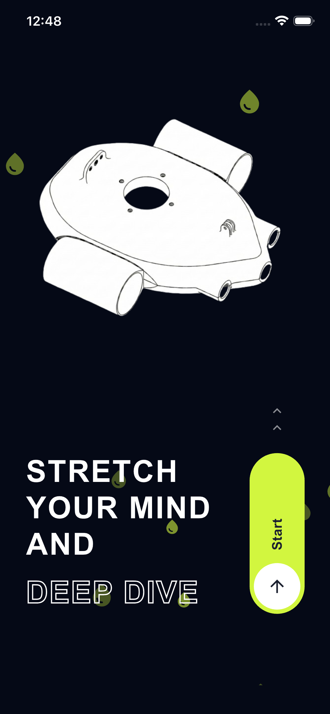
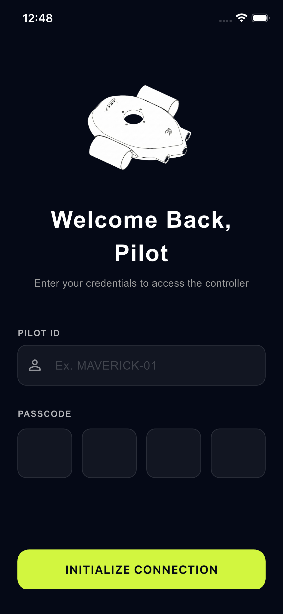
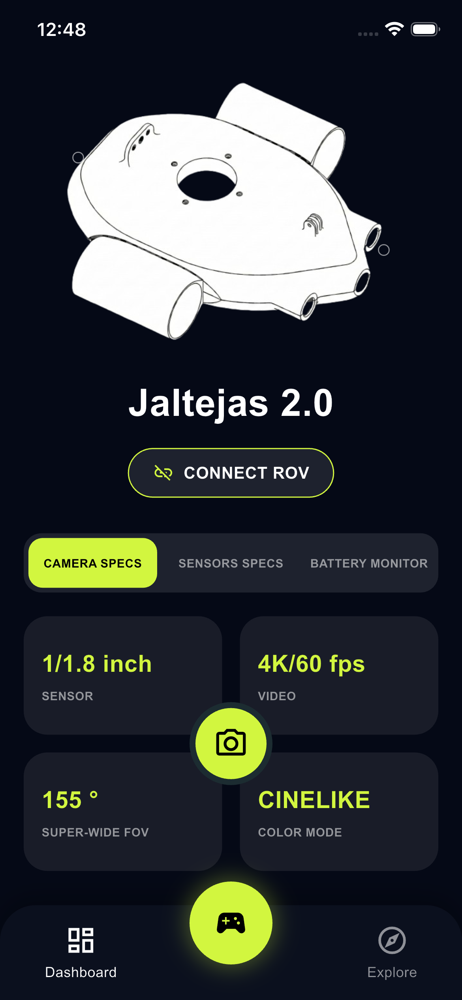
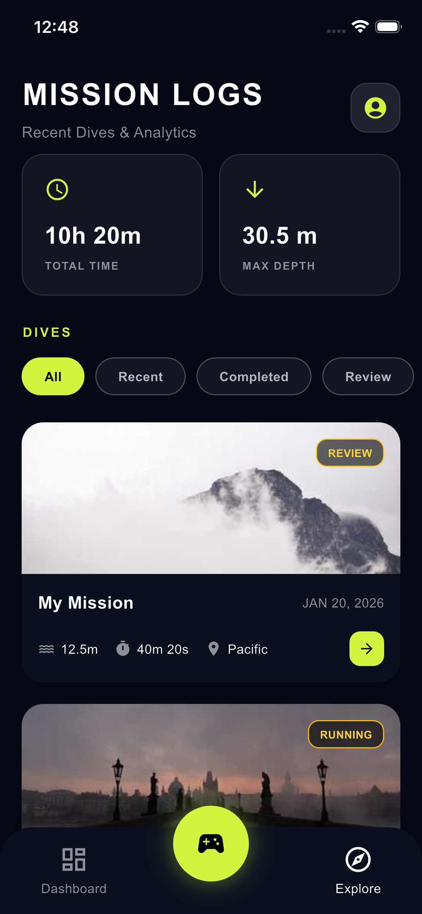
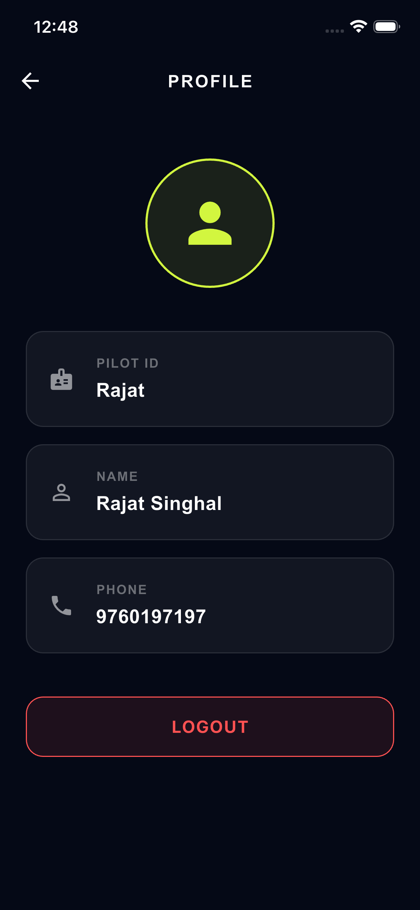
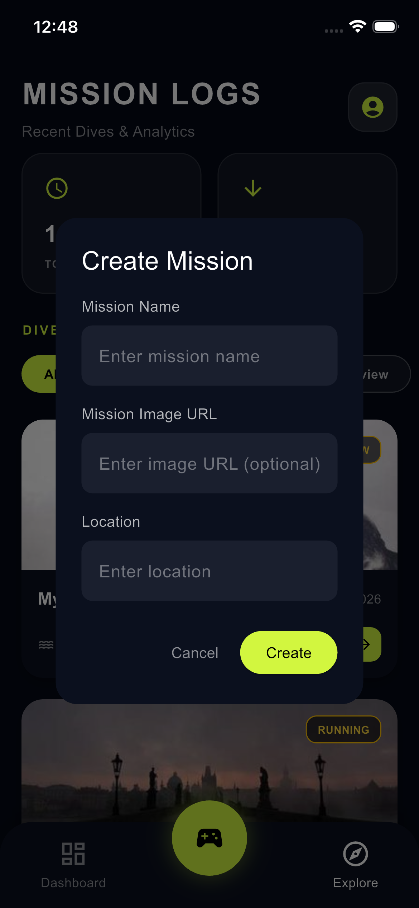
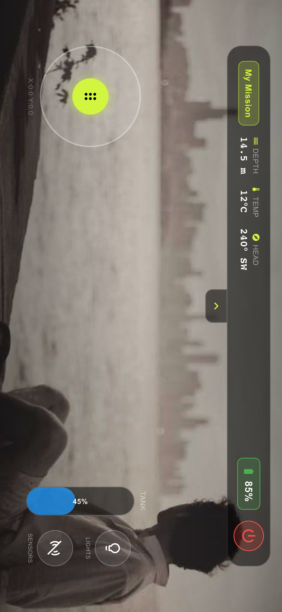

<!DOCTYPE html>
<html lang="en">
<head>
<meta charset="UTF-8" />
<meta name="viewport" content="width=device-width, initial-scale=1.0"/>
<title>Jaltejas Mobile App – Documentation</title>

</head>

<body>

<header>
  <h1>📱 Jaltejas Mobile Application</h1>
  

    The official Flutter-based control application for the Jaltejas Underwater ROV.
    It enables secure authentication, real-time ROV control, mission planning,
    telemetry visualization, AI alerts, and Firebase-powered data storage.
  

</header>

<section>
  <h2>🚀 Key Features</h2>
  

    Flutter
    Firebase
    ROV Control
    AI Alerts
    Live Video

  <ul class="feature-list">
  <li>Secure Pilot Authentication</li>
  <li>Mission creation & tracking</li>
  <li>Live video streaming from ROV</li>
  <li>Depth, heading & battery telemetry</li>
  <li>AI-based underwater object alerts</li>
</ul>

  

</section>

<section>
  <h2>📸 App UI Screenshots</h2>
  

    
    
    
    
    
    
    
    
  

</section>

<section>
  <h2>🧱 Application Architecture</h2>
  

Flutter UI
   ↓
State Management
   ↓
Firebase Auth & Firestore
   ↓
ROV Communication (MAVLink / UDP)
   ↓
AI Detection Alerts
  

</section>

<section>
  <h2>🔄 Application Flowchart</h2>
  

App Launch
   ↓
Pilot Login / Signup
   ↓
Dashboard
   ├── Live Video
   ├── Telemetry
   ├── Create Mission
   └── Mission History
   ↓
Firebase Sync
  

</section>

<section>
  <h2>🗄️ Firebase Database Design</h2>

  <h3>📌 Collection: Pilots</h3>
  

pilotId: "Rajat" (string)
Name: "Rajat Singhal" (string)
Phone: 9760197197 (number)
passcode: 6179 (number)
max_depth: "30.5 m" (string)
total_time: "10h 20m" (string)
  

  <h3>📌 Collection: Missions</h3>
  

mission_id: "Mission01" (string)
mission_name: "My Mission" (string)
pilotId: "Rajat" (string)
location: "Pacific" (string)
depth: "12.5" (string)
duration: "40m 20s" (string)
status: "COMPLETE" (string)
imageUrl: "https://picsum.photos/seed/rov1/400/200" (string)
date: January 20, 2026 at 1:33:24 AM (timestamp)
  

</section>

<section>
  <h2>🧩 ER Diagram</h2>
  

PILOTS ||----o{ MISSIONS

PILOTS:
- pilotId (PK)
- Name
- Phone
- max_depth
- total_time

MISSIONS:
- mission_id (PK)
- pilotId (FK)
- depth
- duration
- location
- status
- date
  

</section>

<section>
  <h2>⚙️ How to Run the App</h2>
  

    

flutter doctor
flutter pub get
flutter run
    

  

</section>

<section>
  <h2>🏆 Hackathon Value</h2>
  

    <ul>
      <li>Real-time robotics control</li>
      <li>Cloud-based mission logging</li>
      <li>AI-powered underwater analysis</li>
      <li>Industry-grade mobile architecture</li>
    </ul>
  

</section>

<footer>
  © 2026 Jaltejas Underwater ROV | Hack-the-Winter | Team Nishchay
</footer>

</body>
</html>
