# 📱 Jaltejas – Mobile Application (Flutter)

The **Jaltejas Mobile App** is the primary control interface for the Jaltejas Underwater ROV.  
It allows pilots to authenticate securely, create and manage missions, monitor live telemetry, view video streams, and store mission data using **Firebase**.

---

## 🚀 Key Features

- Secure Pilot Authentication
- Mission creation and tracking
- Live video streaming from the ROV
- Depth, heading, and battery telemetry
- AI-based underwater object alerts
- Firebase-powered mission logging

---

## 🛠️ Tech Stack

- **Framework:** Flutter  
- **Backend:** Firebase (Authentication + Firestore)  
- **Database:** Firestore  
- **Communication:** MAVLink / UDP  
- **Platform:** Android & iOS  

---

## 📸 App UI Screenshots

### Screens (Preview)

| | |
|---|---|
|  |  |
|  |  |
|  |  |
|  |  |

> All screenshots are stored in `mobile-app/ui-screenshot/`

---

## 🧱 Application Architecture

```mermaid
flowchart TB

%% User Layer
User[👤 Pilot / Operator]

%% Mobile App
MobileApp[📱 Flutter Mobile App]

Auth[🔐 Authentication Module]
MissionUI[🧭 Mission Management UI]
TelemetryUI[📊 Telemetry Dashboard]
VideoUI[🎥 Live Video Viewer]
AIAlertUI[🤖 AI Alerts]

%% Firebase
FirebaseAuth[🔥 Firebase Authentication]
Firestore[🗄️ Firestore Database]

Pilots[(Pilots Collection)]
Missions[(Missions Collection)]

%% ROV Side
ROV[🤿 Underwater ROV]

Companion[🖥️ Raspberry Pi<br/>Companion Computer]
FlightCtrl[🧠 Pixhawk / ArduSub]
Camera[📷 ROV Camera]

%% AI/ML
MLModel[🧠 YOLOv8 AI Model]

%% Connections
User --> MobileApp

MobileApp --> Auth
MobileApp --> MissionUI
MobileApp --> TelemetryUI
MobileApp --> VideoUI
MobileApp --> AIAlertUI

Auth --> FirebaseAuth
MissionUI --> Firestore
TelemetryUI --> Firestore

Firestore --> Pilots
Firestore --> Missions

MobileApp -->|MAVLink / Commands| Companion
MobileApp -->|UDP Video| Camera

Companion --> FlightCtrl
Camera --> Companion

Companion -->|Video Frames| MLModel
MLModel -->|Detection Events| MobileApp
```

---

## 🗄️ Firebase Database Design

### 📌 Collection: `pilots`

| Field Name   | Type    | Description |
|-------------|---------|-------------|
| pilotId     | string  | Unique pilot identifier |
| Name        | string  | Pilot full name |
| Phone       | number  | Pilot phone number |
| passcode    | number  | Login passcode |
| max_depth   | string  | Maximum depth reached |
| total_time  | string  | Total operation time |


---

### 📌 Collection: `missions`

| Field Name    | Type      | Description |
|--------------|-----------|-------------|
| mission_id   | string    | Mission ID |
| mission_name | string    | Mission name |
| pilotId      | string    | Linked pilot |
| location     | string    | Mission location |
| depth        | string    | Depth reached |
| duration     | string    | Mission duration |
| status       | string    | Mission status |
| imageUrl     | string    | Mission image |
| date         | timestamp | Mission date |


---

## ⚙️ How to Run the Application

### 1️⃣ Prerequisites
- Flutter SDK (stable)
- Android Studio / Xcode
- Android Emulator or Physical Device

Check setup:
```bash
flutter doctor

flutter pub get

flutter run


